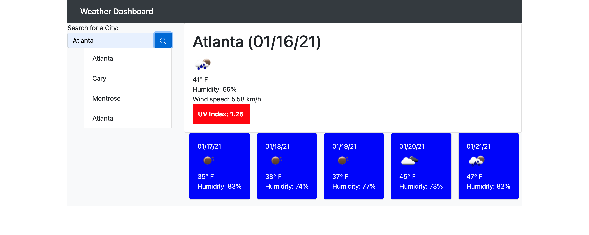
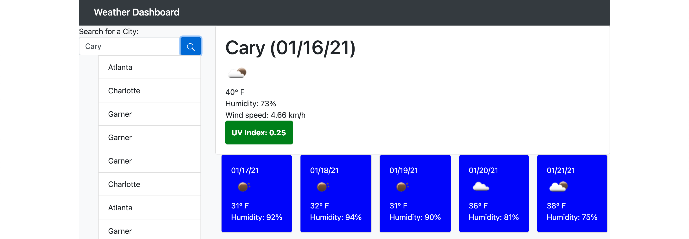

# weather-dashboard

This repository houses UNC Coding Bootcamp Homework Assignment 6, a weather dashboard that will run in the browser and feature dynamically updated HTML and CSS.

It uses:

- HTML to create the static structure of the app

- CSS to style the app

- JavaScript and jQuery to dynamically generate and update the HTML and CSS, as well as calling the OpenWeatherMap API and adding event listeners

- The day.js library to pull and format the correct dates

## Link to Deployed Application
This application can be found at https://smlisk0630.github.io/weather-dashboard/.

## Screenshots

## Credits
- [UNC-Chapel Hill Coding Bootcamp](https://bootcamp.unc.edu/)
- [OpenWeatherMap API](https://openweathermap.org/)
- [day.js](https://day.js.org)
- [Gage Eide, tutor](https://github.com/gage117)